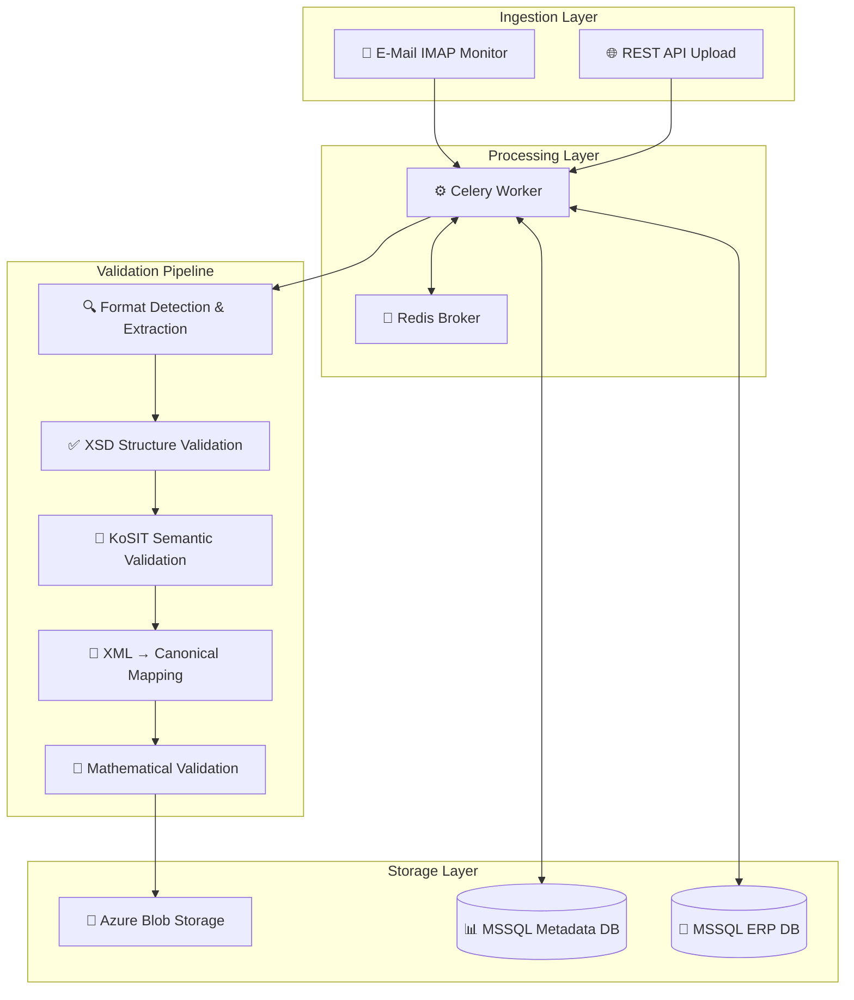

# IIEV-Ultra Systemarchitektur

## 🏗️ Überblick: Produktionsreife E-Rechnungs-Engine

IIEV-Ultra ist eine **vollständig funktionsfähige E-Rechnungs-Validierungs-Engine**, die alle deutschen E-Rechnungsformate (XRechnung, ZUGFeRD, Factur-X) automatisch verarbeiten und validieren kann.

## 🚀 Aktuelle Systemfähigkeiten (Sprint 0-3 Abgeschlossen)

Das System kann **mit hoher Sicherheit bestimmen**, ob eine E-Rechnung **technisch und inhaltlich korrekt** ist:

1. ✅ **E-Rechnungen empfangen** (E-Mail IMAP + REST API)
2. ✅ **Formate erkennen** (XRechnung UBL/CII, ZUGFeRD, Factur-X)
3. ✅ **XML extrahieren** (aus hybriden PDF/A-3 Dokumenten)
4. ✅ **Strukturell validieren** (XSD Schema gegen EN 16931)
5. ✅ **Semantisch validieren** (KoSIT Schematron - deutsche Geschäftsregeln)
6. ✅ **Daten normalisieren** (UBL/CII → einheitliches Canonical Model)
7. ✅ **Mathematisch prüfen** (Summen, Steuern, Rabatte)
8. ✅ **GoBD-konform speichern** (Azure Blob Storage)
9. ✅ **Status verfolgen** (detailliertes Transaction Tracking)

## 🏗️ Systemarchitektur



## 📦 Service-Übersicht

### 🔄 **Core Processing Engine**
- **Celery Worker**: Asynchrone Verarbeitung mit Retry-Logic
- **Race Condition Prevention**: Optimistisches Locking
- **Robuste Fehlerbehandlung**: Transiente vs. permanente Fehler

### 📧 **Ingestion Services**
- **E-Mail Monitor**: IMAP-basierte automatische Überwachung
- **REST API**: FastAPI Upload-Endpoints mit Validierung
- **File Processing**: Multi-Format Support (PDF, XML, P7M)

### 🔍 **Format Detection & Extraction**
```python
src/services/extraction/
├── extractor.py          # Format-Erkennung Orchestrator
├── pdf_util.py          # ZUGFeRD/Factur-X PDF-Extraktion
└── xml_util.py          # XML-Analyse und Namespace-Erkennung
```

**Unterstützte Formate:**
- **XRechnung UBL** (reines XML)
- **XRechnung CII** (reines XML) 
- **ZUGFeRD** (PDF/A-3 mit eingebettetem CII XML)
- **Factur-X** (PDF/A-3 mit eingebettetem CII XML)
- **Einfache PDFs** → `MANUAL_REVIEW`

### ✅ **Validation Pipeline**
```python
src/services/validation/
├── xsd_validator.py         # EN 16931 Schema-Validierung
├── kosit_validator.py       # Deutsche Geschäftsregeln (Schematron)
├── calculation_validator.py # Mathematische Prüfung
└── asset_service.py        # XSD/Schematron Asset Management
```

**Validierungsstufen:**
1. **XSD Structure**: Schema-Compliance gegen EN 16931
2. **KoSIT Semantic**: Deutsche Geschäftsregeln via Schematron
3. **Mathematical**: Summen, Steuern, Rabatte, Rundungstoleranzen
4. **Business** *(Sprint 4-5)*: ERP-Integration und Geschäftslogik

### 🔄 **XML Mapping Engine**
```python
src/services/mapping/
├── mapper.py           # Orchestrator und Format-Routing
├── ubl_mapper.py       # UBL → Canonical Model
├── cii_mapper.py       # CII → Canonical Model  
└── xpath_util.py       # Robuste XPath-Utilities
```

**Features:**
- **EN 16931 Compliance**: Vollständige Abdeckung aller Pflichtfelder
- **Robuste Berechnungslogik**: BasisQuantity/BaseQuantity-Handling
- **Strikte Validierung**: Länder- und Währungscodes
- **Fehlerresilienz**: Graceful Handling optionaler Felder

### 💾 **Storage & Persistence**
- **Azure Blob Storage**: GoBD-konforme Archivierung mit Unveränderlichkeit
- **MSSQL Metadata DB**: Transaction Tracking und Validation Reports
- **MSSQL ERP DB**: Business Validation *(Sprint 4-5)*

## 📊 **Canonical Data Model**

Das System konvertiert alle Formate in ein einheitliches `CanonicalInvoice` Modell:

```python
class CanonicalInvoice(BaseModel):
    # Rechnungsidentifikation
    invoice_number: str
    issue_date: date
    currency_code: CurrencyCode
    
    # Parteien (mit strikter Validierung)
    seller: Party  # inkl. VAT-ID, Adresse
    buyer: Party
    
    # Rechnungszeilen
    lines: List[InvoiceLine]
    
    # Summen (IMMER Decimal für Währungen!)
    tax_exclusive_amount: Decimal  # Nettosumme
    tax_inclusive_amount: Decimal  # Bruttosumme  
    payable_amount: Decimal        # Zahlbetrag
    
    # Steueraufschlüsselung
    tax_breakdown: List[TaxBreakdown]
    
    # Zahlungsinformationen
    payment_details: List[BankDetails]  # IBAN mit schwifty-Validierung
```

## 🧪 **Test Coverage: 103 Tests**

- **101 ✅ bestandene Tests** beweisen Systemstabilität
- **2 ⏭️ übersprungene Tests** (KoSIT - Java Runtime lokal)
- **90+ reale Rechnungsbeispiele** aus allen Formaten erfolgreich verarbeitet

### Test-Kategorien:
- **Unit Tests**: Isolierte Komponenten (Format-Erkennung, Mapping, Validierung)
- **Integration Tests**: End-to-End Workflow-Prüfung
- **Corpus Tests**: Reale Beispiele (UBL, CII, ZUGFeRD PDFs)
- **Robustheit**: Race Conditions, Retry-Logic, Fehlerbehandlung

## 🔧 **Deployment & Operations**

### Docker Container
```dockerfile
# Multi-Stage Build mit:
- Python 3.10 + Poetry
- Java Runtime (für KoSIT Validator)  
- Microsoft ODBC Driver 17 (für MSSQL)
- Non-root User für Security
```

### Azure Services Integration
- **Azure Blob Storage**: Mit Managed Identity oder Connection String
- **Azure SQL**: Metadata-Datenbank (MSSQL-kompatibel)
- **Azure Key Vault**: Secrets Management (Produktion)
- **Azure Container Apps**: Deployment Target

### Monitoring & Observability
- **Structured Logging**: JSON-Format mit Correlation IDs
- **Health Checks**: Detaillierte Service-Status-Prüfung
- **Transaction Tracking**: Vollständige Audit-Trail
- **Performance Metrics**: Processing Times, Throughput

## 🎯 **Nächste Schritte: Sprint 4-5 ERP Integration**

### Sprint 4: Business Validation
**Ziel**: Integration mit Azure MSSQL ERP-Datenbank für Business-Validierung

```python
# Zu implementieren:
src/services/erp/mssql_adapter.py

class MSSQL_ERPAdapter:
    def find_vendor_id(self, vat_id: str) -> Optional[str]
    def is_duplicate(self, vendor_id: str, invoice_number: str) -> bool  
    def validate_bank_details(self, vendor_id: str, iban: str) -> bool
    def validate_po(self, po_number: str) -> bool
```

**Business Checks:**
- **Dublettenprüfung**: Rechnungsnummer bereits im Journal?
- **Kreditor-Lookup**: Absender im ERP-System bekannt?
- **Bankdatenabgleich**: IBAN stimmt mit Stammdaten überein?
- **Bestellabgleich**: PO-Nummer gültig und offen?

### Sprint 5: Produktionsreife
- **Performance Optimierung**: Lasttests mit großen Dateien
- **Security Hardening**: Input Validation, Penetration Tests  
- **Deployment Automation**: CI/CD Pipeline, Infrastructure as Code

## 📋 **ERP Schema Anforderungen (für Sprint 4)**

Für die Business-Validierung benötigen wir folgende ERP-Datenbank Informationen:

1. **Kreditorenstamm**: Tabelle + Spalten für KreditorID, Name, USt-IdNr.
2. **Bankverbindungen**: Tabelle + Spalten für KreditorID, IBAN, BIC
3. **Rechnungsjournal**: Tabelle + Spalten für KreditorID, Externe Rechnungsnummer
4. **Bestellungen** (optional): Tabelle + Spalten für Bestellnummer, Status

**Das System ist bereit für die ERP-Integration! 🚀**
