# IIEV-Ultra Systemarchitektur

## 🏗️ Überblick: Produktionsreife E-Rechnungs-Engine

IIEV-Ultra ist eine **vollständig funktionsfähige E-Rechnungs-Validierungs-Engine**, die alle deutschen E-Rechnungsformate (XRechnung, ZUGFeRD, Factur-X) automatisch verarbeiten und validieren kann.

## 🚀 Aktuelle Systemfähigkeiten (Sprint 0-3 Abgeschlossen)

Das System kann **mit hoher Sicherheit bestimmen**, ob eine E-Rechnung **technisch und inhaltlich korrekt** ist:

1. ✅ **E-Rechnungen empfangen** (E-Mail IMAP + REST API)
2. ✅ **Formate erkennen** (XRechnung UBL/CII, ZUGFeRD, Factur-X)
3. ✅ **XML extrahieren** (aus hybriden PDF/A-3 Dokumenten)
4. ✅ **Strukturell validieren** (XSD Schema gegen EN 16931)
5. ✅ **Semantisch validieren** (KoSIT Schematron - deutsche Geschäftsregeln)
6. ✅ **Daten normalisieren** (UBL/CII → einheitliches Canonical Model)
7. ✅ **Mathematisch prüfen** (Summen, Steuern, Rabatte)
8. ✅ **GoBD-konform speichern** (Azure Blob Storage)
9. ✅ **Status verfolgen** (detailliertes Transaction Tracking)

## 🏗️ Systemarchitektur

```mermaid
graph TB
    subgraph "Ingestion Layer"
        EMAIL[📧 E-Mail IMAP Monitor]
        API[🌐 REST API Upload]
    end
    
    subgraph "Processing Layer"
        CELERY[⚙️ Celery Worker]
        REDIS[🔄 Redis Broker]
    end
    
    subgraph "Validation Pipeline"
        EXTRACT[🔍 Format Detection & Extraction]
        XSD[✅ XSD Structure Validation]
        KOSIT[🧠 KoSIT Semantic Validation]
        MAPPER[🔄 XML → Canonical Mapping]
        CALC[🧮 Mathematical Validation]
    end
    
    subgraph "Storage Layer"
        BLOB[💾 Azure Blob Storage]
        METADB[(📊 MSSQL Metadata DB)]
        ERPDB[(🏢 MSSQL ERP DB)]
    end
    
    EMAIL --> CELERY
    API --> CELERY
    CELERY <--> REDIS
    CELERY --> EXTRACT
    EXTRACT --> XSD
    XSD --> KOSIT
    KOSIT --> MAPPER
    MAPPER --> CALC
    CALC --> BLOB
    CELERY <--> METADB
    CELERY <--> ERPDB
```



## 📦 Service-Übersicht

### 🔄 **Core Processing Engine**
- **Celery Worker**: Asynchrone Verarbeitung mit Retry-Logic
- **Race Condition Prevention**: Optimistisches Locking
- **Robuste Fehlerbehandlung**: Transiente vs. permanente Fehler

### 📧 **Ingestion Services**
- **E-Mail Monitor**: IMAP-basierte automatische Überwachung
- **REST API**: FastAPI Upload-Endpoints mit Validierung
- **File Processing**: Multi-Format Support (PDF, XML, P7M)

### 🔍 **Format Detection & Extraction**
```python
src/services/extraction/
├── extractor.py          # Format-Erkennung Orchestrator
├── pdf_util.py          # ZUGFeRD/Factur-X PDF-Extraktion
└── xml_util.py          # XML-Analyse und Namespace-Erkennung
```

**Unterstützte Formate:**
- **XRechnung UBL** (reines XML)
- **XRechnung CII** (reines XML) 
- **ZUGFeRD** (PDF/A-3 mit eingebettetem CII XML)
- **Factur-X** (PDF/A-3 mit eingebettetem CII XML)
- **Einfache PDFs** → `MANUAL_REVIEW`

### ✅ **Validation Pipeline**
```python
src/services/validation/
├── xsd_validator.py         # EN 16931 Schema-Validierung
├── kosit_validator.py       # Deutsche Geschäftsregeln (Schematron)
├── calculation_validator.py # Mathematische Prüfung
└── asset_service.py        # XSD/Schematron Asset Management
```

**Validierungsstufen:**
1. **XSD Structure**: Schema-Compliance gegen EN 16931
2. **KoSIT Semantic**: Deutsche Geschäftsregeln via Schematron
3. **Mathematical**: Summen, Steuern, Rabatte, Rundungstoleranzen
4. **Business** *(Sprint 4-5)*: ERP-Integration und Geschäftslogik

### 🔄 **XML Mapping Engine**
```python
src/services/mapping/
├── mapper.py           # Orchestrator und Format-Routing
├── ubl_mapper.py       # UBL → Canonical Model
├── cii_mapper.py       # CII → Canonical Model  
└── xpath_util.py       # Robuste XPath-Utilities
```

**Features:**
- **EN 16931 Compliance**: Vollständige Abdeckung aller Pflichtfelder
- **Robuste Berechnungslogik**: BasisQuantity/BaseQuantity-Handling
- **Strikte Validierung**: Länder- und Währungscodes
- **Fehlerresilienz**: Graceful Handling optionaler Felder

### 💾 **Storage & Persistence**
- **Azure Blob Storage**: GoBD-konforme Archivierung mit Unveränderlichkeit
- **MSSQL Metadata DB**: Transaction Tracking und Validation Reports
- **MSSQL ERP DB**: Business Validation *(Sprint 4-5)*

## 📊 **Canonical Data Model**

Das System konvertiert alle Formate in ein einheitliches `CanonicalInvoice` Modell:

```python
class CanonicalInvoice(BaseModel):
    # Rechnungsidentifikation
    invoice_number: str
    issue_date: date
    currency_code: CurrencyCode
    
    # Parteien (mit strikter Validierung)
    seller: Party  # inkl. VAT-ID, Adresse
    buyer: Party
    
    # Rechnungszeilen
    lines: List[InvoiceLine]
    
    # Summen (IMMER Decimal für Währungen!)
    tax_exclusive_amount: Decimal  # Nettosumme
    tax_inclusive_amount: Decimal  # Bruttosumme  
    payable_amount: Decimal        # Zahlbetrag
    
    # Steueraufschlüsselung
    tax_breakdown: List[TaxBreakdown]
    
    # Zahlungsinformationen
    payment_details: List[BankDetails]  # IBAN mit schwifty-Validierung
```

## 🧪 **Test Coverage: 103 Tests**

- **101 ✅ bestandene Tests** beweisen Systemstabilität
- **2 ⏭️ übersprungene Tests** (KoSIT - Java Runtime lokal)
- **90+ reale Rechnungsbeispiele** aus allen Formaten erfolgreich verarbeitet

### Test-Kategorien:
- **Unit Tests**: Isolierte Komponenten (Format-Erkennung, Mapping, Validierung)
- **Integration Tests**: End-to-End Workflow-Prüfung
- **Corpus Tests**: Reale Beispiele (UBL, CII, ZUGFeRD PDFs)
- **Robustheit**: Race Conditions, Retry-Logic, Fehlerbehandlung

## 🔧 **Deployment & Operations**

### Docker Container
```dockerfile
# Multi-Stage Build mit:
- Python 3.10 + Poetry
- Java Runtime (für KoSIT Validator)  
- Microsoft ODBC Driver 17 (für MSSQL)
- Non-root User für Security
```

### Azure Services Integration
- **Azure Blob Storage**: Mit Managed Identity oder Connection String
- **Azure SQL**: Metadata-Datenbank (MSSQL-kompatibel)
- **Azure Key Vault**: Secrets Management (Produktion)
- **Azure Container Apps**: Deployment Target

### Monitoring & Observability
- **Structured Logging**: JSON-Format mit Correlation IDs
- **Health Checks**: Detaillierte Service-Status-Prüfung
- **Transaction Tracking**: Vollständige Audit-Trail
- **Performance Metrics**: Processing Times, Throughput

## ✅ **Sprint 4-5 ABGESCHLOSSEN: ERP Integration**

### Business Validation - VOLLSTÄNDIG IMPLEMENTIERT
**Status**: ✅ Produktionsreif (September 2025)

Das System verfügt jetzt über vollständige **ERP-Integration mit 3-Way-Match**:

```mermaid
graph LR
    subgraph "Business Validation Pipeline"
        INVOICE[📄 Validated Invoice]
        ADAPTER[🔌 ERP Adapter]
        VENDOR[👤 Vendor Lookup]
        DUPLICATE[🔍 Duplicate Check]
        BANK[🏦 Bank Validation]
        PO[📋 PO Matching]
        MATCH[🎯 3-Way Match]
    end
    
    subgraph "ERP Database"
        ERPDB[(🏢 Azure MSSQL)]
    end
    
    INVOICE --> ADAPTER
    ADAPTER --> VENDOR
    VENDOR --> DUPLICATE
    DUPLICATE --> BANK
    BANK --> PO
    PO --> MATCH
    ADAPTER <--> ERPDB
```



### Implementierte Business Checks

1. **✅ Kreditor-Identifikation**
   - Lookup via USt-IdNr in ERP-Stammdaten
   - Aktivitätsstatus-Prüfung

2. **✅ Dublettenprüfung**
   - Verhindert Doppelbuchungen
   - Prüfung im Rechnungsjournal

3. **✅ Bankdaten-Validierung (Fraud Prevention)**
   - IBAN-Abgleich mit Stammdaten
   - Schutz vor manipulierten Zahlungsdaten

4. **✅ 3-Way-Match (Erweitert)**
   - **Bestellstatus**: Offen/Geschlossen
   - **Betragsabgleich**: Rechnungsnetto vs. Bestellnetto (±0.02 EUR Toleranz)
   - **Positionsabgleich**: HAN/EAN/GTIN-basiertes Matching
   - **Mengenprüfung**: Rechnungsmenge vs. offene Bestellmenge

### Technische Implementierung

```python
# Implementiert in src/services/erp/
interface.py        # Abstract Base Class mit Datenstrukturen
mssql_adapter.py    # Konkrete MSSQL Implementierung
business_validator.py # Orchestrierung der Validierung

# Erweiterte Datenmodelle
CanonicalInvoice.InvoiceLine.item_identifier  # NEU: HAN/EAN/GTIN Feld

# Mapper-Erweiterungen
ubl_mapper.py    # Extrahiert StandardItemIdentification/SellersItemIdentification
cii_mapper.py    # Extrahiert GlobalID/SellerAssignedID
```

### Zwei-Datenbank-Architektur

```python
# Getrennte Sessions für Sicherheit und Isolation
with get_metadata_session() as db_meta:     # PostgreSQL/Azure SQL (R/W)
    with get_erp_session() as db_erp:       # Azure MSSQL (Read-Only!)
        erp_adapter = MSSQL_ERPAdapter(db_erp)
        validate_business_rules(invoice, erp_adapter)
```

## 🎯 **Nächste Schritte: Sprint 6 - Optimierungen & Erweiterte Features**

### Performance & Skalierung
- **Caching-Layer**: Redis-Cache für Stammdaten
- **Batch Processing**: Parallele Verarbeitung großer Mengen
- **Connection Pooling**: Optimierung der DB-Verbindungen

### Erweiterte Business Features
- **Kontierungsvorschläge**: Automatische Sachkonten-Zuordnung
- **Machine Learning**: Anomalie-Erkennung bei Rechnungsmustern
- **Approval Workflow**: Integration mit Microsoft Teams/Outlook
- **Dashboard**: Real-time Analytics und KPIs

### Integration & APIs
- **REST API für ERP-Feedback**: Status-Updates an ERP zurückmelden
- **Webhook Support**: Event-basierte Benachrichtigungen
- **Multi-ERP Support**: Adapter für SAP, Oracle, etc.

## 📋 **Deployment Readiness Checklist**

- [x] Core Processing Engine
- [x] Format Detection & Extraction  
- [x] Technical Validation (XSD)
- [x] Semantic Validation (KoSIT)
- [x] Mathematical Validation
- [x] ERP Integration mit 3-Way-Match
- [x] GoBD-konforme Archivierung
- [x] Transaction Tracking & Audit Trail
- [ ] Production Monitoring Setup
- [ ] Load Testing & Performance Tuning
- [ ] Security Audit & Penetration Testing
- [ ] CI/CD Pipeline
- [ ] Documentation & Training Materials

**Das System ist funktional vollständig und bereit für Produktionstests! 🚀**
